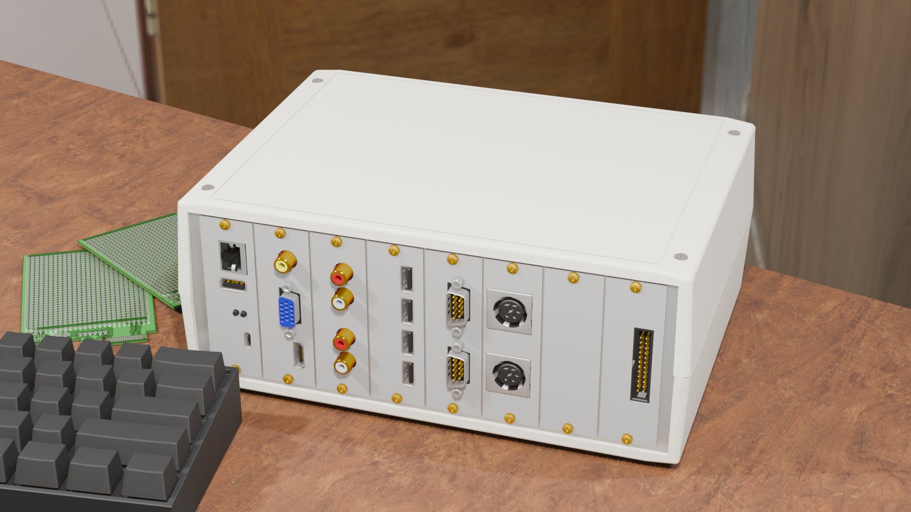

# Ashet Home Computer

<!-- <h2>The 21st century home computer</h2> -->

<h2>Bridging the Gap Between Learning and Making<h2>

---

---

The Ashet Home Computer is an expandable and hackable computer in the spirits of the 80's home computers.

Fully understandable by a single person, yet powerful enough to run a graphical desktop OS, it tries to bridge the gap between Arduinos and a RaspberryPi.

It is designed and engineered for fun and learning, which best go hand in hand.

---

<h2 class="display-5 text-center">Features</h2>

    
Specifications

    

    

    <ul>
        <li>Dual Core CPU with 150 MHz</li>
        <li>16 MB Flash</li>
        <li>8 MB RAM</li>
        <li>Modern Connectivity (USB, Ethernet, DVI)</li>
    </ul>
    

    
Expandable

    

    

    <ul>
        <li>7 Expansion Slots</li>
        <li>Many Expansions Available</li>
        <li>Hackable OS</li>
        <li>Handmade Expansions Possible</li>
    </ul>
    

    
Designed For Education

    

    

    <ul>
        <li>Fully Open Architecture</li>
        <li>Built-in Debug Probe</li>
        <li>Fully Documented</li>
        <li>Decision Making Documentation</li>
        </ul>
    

---

<h2 class="display-5 text-center">Project Status</h2>

The design phase is done. The final concept for the hardware is defined and achievable.

The OS boots on the RP2350 and allows to start desktop applications.

The next steps are completing a prototype which provides all planned features in a stripped down manner. Afterwards, the project can enter the product design phase, where a marketable computer is designed and production is clarified.

For this, funding is required which will be done via a crowdfunding platform like Indiegogo, Kickstarter or similar.

---

    <a href="https://www.indiegogo.com/" class="btn btn-primary" role="button">Indiegogo</a>
    <a href="about/" class="btn btn-primary" role="button">Our Vision</a>
    <a href="hardware/" class="btn btn-primary" role="button">Hardware Details</a>

